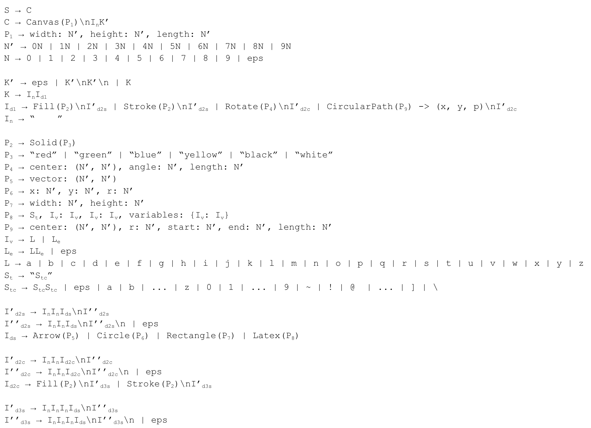

# Parser

## Team Members
* Carl von Bonin (cv2546)
* Adheesh Kadiresan (ak4907)

## Token types
* Identifier (ID)
* Left parenthesis (LPAR)
* Right parenthesis (RPAR)
* Left brace (LBRACE)
* Right brace (RBRACE)
* Number (NUM)
* Colon (COLON)
* Comma (COMMA)
* Indentation (INDENT) - Note: This replaces the whitespace token we had for the last part
* ARROW 
* String Literal (LIT)

# Context-Free Grammar

## Installation
### TODO: Update from last part
With Docker: 
1. `cd` into this folder `code-generation`
2. Run `docker build --tag code-generation .` in this folder
3. Run `docker run -v $(pwd):/app code-generation <input file name> <output animation folder name>`

Straight with Python (if Python is installed and the interpreter is in PATH):
1. `cd` into this folder `code-generation`
2. Run `python main.py <input file name> <output animation folder name>` in this folder