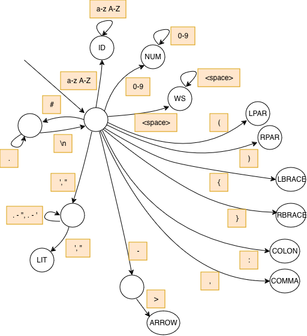

# Lexical analysis

## Team Members
* Carl von Bonin (cv2546)
* Adheesh Kadiresan (ak4907)

## Token types
* Identifier (ID)
* Left parenthesis (LPAR)
* Right parenthesis (RPAR)
* Left brace (LBRACE)
* Right brace (RBRACE)
* Number (NUM)
* Colon (COLON)
* Comma (COMMA)
* Whitespace (WS)
* Arrow 
* String Literal (LIT)

## Lexical Grammar/Token Rules
* Identifier: Any contiguous sequence of alphabetical characters
  * Regex: `[a-zA-z]+`
* Number: Any contiguous sequence of digits (0-9) 
   * Regex: `[0-9]+`
* Left parenthesis: "("
  * Regex: `\(`
* Right parenthesis: ")"
  * Regex: `\)`
* Left brace: "{"
  * Regex: `\{`
* Right brace: "}"
  * Regex: `\}`
* Colon: ":"
  * Regex: `:`
* Comma: ","
  * Regex: `,`
* Whitespace: Any contiguous sequence of spaces
  * Regex: `[ ]+`
* Arrow: "->"
  * Regex: `\-\>`
* String literal: Either ' or ", followed by any sequence of characters, followed by ' or "
  * Regex: `['"].*?['"]`

## Finite State Machine Diagram

## Installation
With Docker: 
1. Run `lexical-analysis % docker build --tag lexical-analyzer .` in this folder
2. Run `docker run lexical-analyzer <input file name>`

Straight with Python (if Python is installed and the interpreter is in PATH):
1. Run `python main.py <input file name>` in this folder

## Test file names
* `test.txt`: A properly formatted program
* `test-2.txt`: Adding garbage characters to `test.txt` to test error checking
* `test-3.txt`: Testing incomplete arrow (a hyphen without a ">") error checking
* `test-4.txt`: Testing arrow token further and other identifier/character formats
* `test-5.txt`: Another properly formatted program

## Program Description
* The main function opens the file passed in and passes the content text into tokenize()
* tokenize() steps through the text character-by-character. 
  * Lines 14-27 check if we are in a comment. If so, we don't parse this. 
  * Lines 29-48 handle the case where we are in the middle of parsing a token. 
    * 32-39: If the character is a valid element of the current token, add the character to the current token and increment the index. Arrows are special, since they are only two characters and the identified token can be printed immediately, the token terminated, and we move onto the next character. 
    * 40-43: This handles the special case where we are in the middle of an arrow but the current character is not ">" as it should be. We print the detected error and terminate the token. 
    * 44-48: For non-arrow tokens, reaching a non-valid character means that the previous token characters made up a valid token that can be printed. We print the identified token. 
  * 49-59 are run when there is no current token. This happens after parsing an arrow or when an invalid character for a previous token is reached. It sets loop variables to indicate that we are now in a new token. Lines 57-59 throw the lexical error when the current character is not a valid starting character for any token. 
  * Lines 61-67 run after the loop is done. This handles ending tokens. Since most tokens have been detected by the occurence of a following character not in the token, if the file ends on a valid token, we print it here. Arrows and string literals are special again, where the lack of the correct ending (a quote for literals, ">" for arrows) means we have an error. Thus, we also print to indicate these errors.